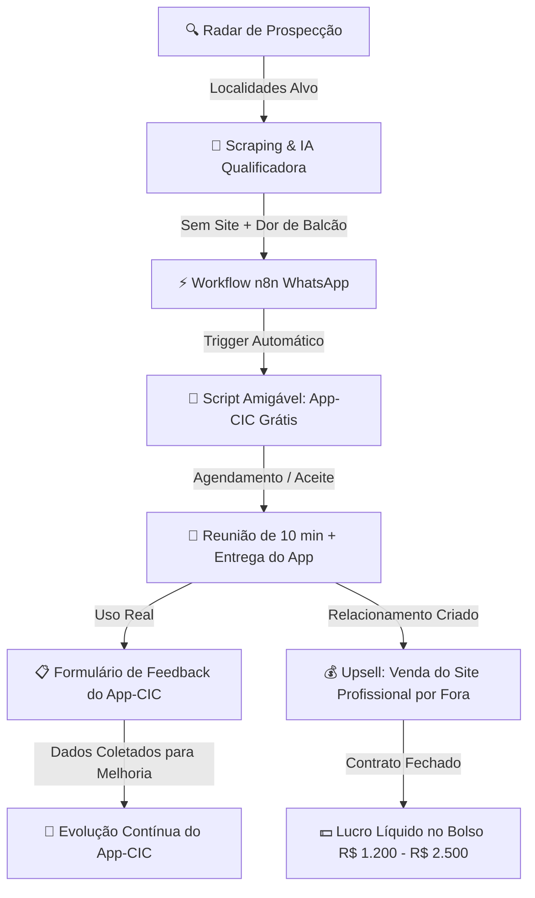

# 🧠 Segundo Cérebro: Operação App-CIC & Fábrica de Sites

> [!abstract] Resumo da Máquina
> Esta operação é um sistema híbrido de **Software Gratuito como Isca (Cavalo de Tróia)** + **Prestação de Serviço de Alto Valor (Desenvolvimento de Sites e Presença Web)**.
> Nós identificamos pequenos comércios locais que não têm site e possuem dor de estoque/balcão, oferecemos o **App-CIC 100% gratuito** em troca de preenchimento de formulário de feedback e, após estabelecer confiança na reunião/visita, oferecemos o desenvolvimento de site profissional e vitrine virtual por fora.

---

## 🗺️ Mapa de Conexões (Neurônios Ativos)

---

## 📑 Índice de Notas do Cérebro

1. [[01 - ESTRATEGIA CAVALO DE TROIA (App-CIC Grátis + Upsell Site)|01. Estratégia Cavalo de Tróia: App-CIC Grátis + Upsell de Site]]
   - A tese de valor irrecusável
   - Por que doar o software destrói o ceticismo do comerciante
   - O contrato psicológico do Beta Tester

2. [[02 - NEURONIO DE PROSPECCAO E RADAR LOCAL|02. Neurônio de Prospecção & As 4 Regiões-Alvo]]
   - *Cocaia (Guarulhos)*: Alta densidade comercial, mercearias e hortifrutis
   - *Senac Jurubatuba*: Restaurantes, xerox, lanchonetes de fluxo universitário
   - *Rua Maria Benedita Rodrigues, 91*: Comércios tradicionais e depósitos
   - *Copan & Alto do Ipiranga*: Cafés, galerias históricas e comércios nobres

3. [[03 - SCRIPTS DE WHATSAPP DE ALTA CONVERSAO|03. Scripts de WhatsApp (Gatilhos Psicológicos)]]
   - Script 1: Abordagem amigável de pesquisa & convite Beta Tester
   - Script 2: Confirmação de demonstração rápida (10 min)
   - Script 3: Lembrete do Formulário de Feedback
   - Script 4: Gancho sutil para o Site Profissional

4. [[04 - FORMULARIO DE FEEDBACK DO APP-CIC|04. Estrutura do Formulário de Feedback (Google Forms / Tally)]]
   - Perguntas de ouro para melhoria de produto
   - Avaliação de UX, balcão e velocidade
   - Caixa de depoimento espontâneo para prova social

5. [[05 - ESTEIRA DE VENDA DO SITE POR FORA (UPSELL)|05. Esteira de Venda do Site por Fora (Lucro R$ 1.500+)]]
   - Como apresentar a proposta sem parecer vendedor chato
   - Estrutura da oferta (Site responsivo + Botão WhatsApp + Google Meu Negócio)
   - Tabela de preços e recorrência mensal de suporte

6. [[../n8n/README-WORKFLOW-N8N|06. Automação n8n: Disparos & Webhooks]]
   - Arquivo pronto para importação: `workflow-n8n-autolead-whatsapp.json`
   - Conexão com Evolution API / Z-API e planilhas

---

## 💡 Princípios Fundamentais (Mindset)

- **Zero Push Comercial Inicial**: Ninguém gosta de receber vendedor desconhecido tentando empurrar produto no WhatsApp. Mas todo dono de comércio adora receber **atenção genuína, ferramenta grátis e escuta**.
- **O Cliente Faz a Venda Sozinho**: Ao instalar o App-CIC e perguntar onde os clientes dele acham os produtos dele na internet, ele mesmo percebe o vácuo de não ter site.
- **Feedback é Ouro**: Cada crítica recebida no formulário é uma funcionalidade que torna o App-CIC mais robusto e rentável no longo prazo.
